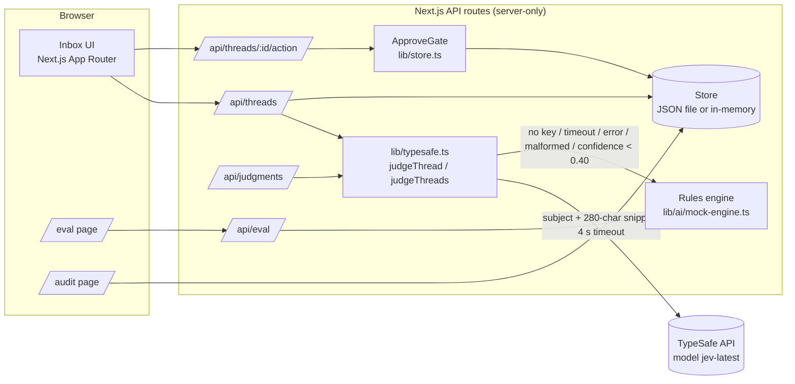

# ApproveGate Inbox

**An AI inbox butler that triages support threads and drafts replies, with a hard human approval gate: nothing risky goes out without an operator.**

- Live demo: **https://approvegate-inbox.vercel.app**
- Repository: https://github.com/Ritesist/approvegate-inbox
- Hackathon: Build Fast with AI 2026, round 2 (Project Submission), track Inbox-to-Action Butler

---

## The problem

Support and ops inboxes mix routine mail (newsletters, invoice copies, demo requests) with messages where a wrong automated reply is costly: refunds and chargebacks, security reports, legal notices, outages, angry enterprise customers. Fully autonomous AI agents are fast but can send a bad refund promise or leak data. Fully manual triage is slow.

ApproveGate Inbox sits in the middle. AI does the reading, sorting, and drafting. A server-side gate makes it impossible to send any reply that a human has not explicitly approved, and every decision is written to an audit log.

## How it works

1. **Ingest**: 36 realistic, messy support threads ship as fixtures (`data/fixtures/messy-inbox.json`); CSV/JSON import is also supported.
2. **Triage**: a deterministic rules engine assigns priority (P0 to P3), category, owner, and a draft reply with suggested actions.
3. **Typed judgment (TypeSafe Jev)**: each thread is also judged by TypeSafe's `jev-latest` model, which returns typed answers: does this need human approval (probability), what kind of action is it, and how urgent is it. Low-confidence answers are flagged **Needs review**.
4. **Approval gate**: the operator approves, edits, rejects, or snoozes the draft. `send` is refused (HTTP 403, `send_blocked` audit entry) unless the thread is approved by a human. Editing an approved draft revokes the approval.
5. **Audit and eval**: `/audit` shows the append-only ledger; `/eval` scores triage against golden labels and checks the "never sent without approval" invariant.

## Architecture



The TypeSafe key only exists on the server (`import 'server-only'`); the browser never sees it. Only the subject and a 280-character snippet of each thread are sent to TypeSafe.

## TypeSafe Jev judgments and the rules fallback

`src/lib/typesafe.ts` asks Jev three typed questions per thread in one `systemOne` call:

| Question | Type | Used for |
|---|---|---|
| `needs_approval` | Noul (probability 0..1) | `needsApproval = p >= 0.5` |
| `action_type` | Choice: escalation, refund, investigation, action, archive | suggested action |
| `urgency` | Score over 4 ordered levels | mapped to P3, P2, P1, P0 |

Decision rules:

- **Confidence** = min(Choice confidence, Score confidence).
- **confidence >= 0.70**: Jev answer is used as is.
- **0.40 <= confidence < 0.70**: Jev answer is used but the thread is flagged **Needs review**. It is also flagged when the approval probability is indecisive (within 0.15 of 0.5).
- **confidence < 0.40**: the rules engine answer is used, the thread is flagged Needs review, and the raw Jev answer is kept for display.
- **4-second timeout** (`TYPESAFE_TIMEOUT_MS = 4000`, no retries). Batch judging runs 8 requests in parallel with a 6-second overall deadline.
- **Fallback** to the rules engine on: missing or blank key (`no_api_key`), timeout (`timeout`), HTTP or network errors (`error:<status>`), malformed responses (`malformed_response`), low confidence (`low_confidence`). The fallback reason is returned in the API and shown in the UI. Judging never throws.
- Successful Jev answers are cached in memory per thread content, so reloads do not re-bill; failures are not cached, so the next request retries.

The approval gate does not depend on the AI at all: even if Jev says "no approval needed", `send` still requires a human approval.

## Setup

Requirements: Node.js 18+ and npm.

```bash
git clone https://github.com/Ritesist/approvegate-inbox.git
cd approvegate-inbox
npm i
cp .env.example .env.local   # optional, only if you have a TypeSafe key
npm run dev                  # http://localhost:3000
npm test                     # vitest, no network or key needed
npm run build                # production build
```

### Environment variables

| Variable | Required | Default | Purpose |
|---|---|---|---|
| `TYPESAFE_API_KEY` | No | unset | Enables TypeSafe Jev typed judgments. Without it, every judgment falls back to the rules engine and the app works fully offline. |
| `APPROVEGATE_STORE_PATH` | No | `data/store.json` | Where the local JSON store is written. Tests set this to a temp file. |
| `OPENAI_API_KEY`, `GEMINI_API_KEY` | No | unset | Optional alternative draft engines selectable on `/settings`. |

Put keys in `.env.local` (gitignored). Never commit them. On Vercel, set `TYPESAFE_API_KEY` in the project's environment variables. On serverless hosts the store stays in memory.

## API endpoints

| Method | Path | Description |
|---|---|---|
| GET | `/api/threads` | List threads with triage and judgment. Filters: `search`, `priority`, `category`, `approvalStatus`, `tier`, `judge=rules` |
| POST | `/api/threads` | Import threads (CSV/JSON payload) |
| GET | `/api/threads/:id` | One thread |
| POST | `/api/threads/:id/triage` | Re-run triage for a thread |
| POST | `/api/threads/:id/action` | `{action: "approve" \| "edit" \| "reject" \| "snooze" \| "toggle_action" \| "send"}`. `send` returns 403 unless human-approved |
| GET | `/api/threads/:id/audit` | Audit entries for a thread |
| GET | `/api/judgments` | TypeSafe judgments for all threads plus a summary (`typesafe`, `heuristic`, `needsReview`, `keyConfigured`). `?refresh=1` clears the cache, `?judge=rules` forces the fallback |
| GET/POST | `/api/eval` | Run the evaluation against golden labels and the invariant check |
| POST | `/api/triage-all` | Triage all untriaged threads |
| POST | `/api/seed` | Reset to the demo fixture |
| GET | `/api/audit-log` | Full audit ledger |
| GET/POST | `/api/settings` | Engine settings |

## Evaluation (real numbers)

All numbers below come from the app itself on the live deployment (1 Oct 2026).

**Rules engine vs golden labels** (`/api/eval`, 36 threads with hand-checked labels in `data/fixtures/golden-labels.json`):

| Metric | Result |
|---|---|
| Threads evaluated | 36 / 36 |
| Priority accuracy | 100% (P0: 6, P1: 12, P2: 7, P3: 11) |
| Category accuracy | 100% |
| Invariant "never sent without approval" | Passed, 0 violations |

Honest caveat: the rules engine was calibrated on these same 36 threads, so 100% here shows the fallback is consistent, not that it generalises. A larger held-out set is future work.

**TypeSafe Jev in production** (`/api/judgments?refresh=1`, model `jev-latest`):

| Metric | Result |
|---|---|
| Threads judged | 36 (full batch in 892 ms server time) |
| Answered by Jev (`source: typesafe`) | 35 / 36 |
| Fell back to rules | 1 / 36 (`thread-002`, reason `low_confidence`) |
| Flagged Needs review | 18 / 36 |
| Flagged needs approval | 22 / 36 |
| Median Jev confidence | 0.77 |
| Median Jev latency per thread | 158 ms (max 285 ms) |
| Jev urgency = golden priority (exact) | 26 / 35 (74%) |
| Jev urgency within one level of golden | 35 / 35 (100%) |
| Golden P0 threads marked needs approval | 6 / 6 (Jev rated 5 of 6 as P0) |

Model version reported by the API: `jev-1.13.0`. Numbers can shift slightly between runs.

Jev was not tuned on these labels, so its agreement number is the more realistic measure; the cases where it disagrees are exactly the ones the Needs review flag and the human gate are designed to catch.

## Tests

`npm test` runs 49 Vitest tests in 6 files. The network is mocked, no key is needed, and the store is redirected to a temp file so `data/store.json` is never modified.

| File | What it covers |
|---|---|
| `approve-gate-invariant.test.ts` | send blocked without approval, edit revokes approval, audit entries |
| `triage.test.ts` | rules triage on fixture threads |
| `eval-metrics.test.ts` | precision / recall / F1 computation |
| `typesafe-fallback.test.ts` | Jev happy path, cache, basic fallback |
| `typesafe-reliability.test.ts` | 4 s timeout, HTTP errors, needs-review thresholds (0.40 / 0.70), missing or blank key, 10 malformed response shapes, score clamping |
| `typesafe-sdk-network.test.ts` | the real SDK caller with the TypeSafe client mocked: model, timeout, no retries, network error, malformed payload |

## Demo

- Live app: https://approvegate-inbox.vercel.app (no login, no key needed to try it)
- 3-minute walkthrough script: [docs/DEMO_SCRIPT_3MIN.md](docs/DEMO_SCRIPT_3MIN.md)
- Demo video (2:48): [ApproveGate_Demo.mp4](https://github.com/Ritesist/approvegate-inbox/releases/download/v1.0-round2/ApproveGate_Demo.mp4)
- Deck (10 slides): [ApproveGate_BuildFast.pdf](https://github.com/Ritesist/approvegate-inbox/releases/download/v1.0-round2/ApproveGate_BuildFast.pdf)
- Release page: [v1.0-round2](https://github.com/Ritesist/approvegate-inbox/releases/tag/v1.0-round2)

## Project structure

```
src/
  app/            pages (inbox, /eval, /audit, /settings) and API routes
  components/     UI components (JudgmentBadge, ApproveGatePanel, modals)
  lib/
    typesafe.ts   TypeSafe Jev judgments, thresholds, timeout, fallback, cache
    store.ts      store + ApproveGate invariant enforcement
    eval.ts       metrics and invariant evaluator
    ai/           rules (mock) engine, optional OpenAI / Gemini engines
  test/           Vitest suites
data/fixtures/    36 messy threads and golden labels
docs/             deploy notes, demo script, deck outline, AI disclosure
```

## AI tools used (disclosure)

ApproveGate Inbox was built with AI assistance. Humans (Ritesh) defined the product, the hard approval gate, the security boundaries, and accepted the final behaviour.

**During development**

| Tool | Role |
|---|---|
| Antigravity (`agy`) | AI coding agent for scaffolding, UI restyle, polish |
| Cursor and Grok Bot agents | build, tests, TypeSafe integration, docs, deck and demo video packaging |
| AI-generated fixtures | the 36 messy support threads; golden labels were reviewed by hand |

**At runtime**

| Component | Role |
|---|---|
| TypeSafe Jev (`jev-latest`) | typed judgments: needs approval, action type, urgency, with confidence |
| Rules engine (built in) | deterministic triage and drafts; fallback for every Jev failure |
| OpenAI / Gemini (optional) | alternative draft engines if keys are set on `/settings` |

AI never sends anything. Every outbound reply needs explicit human approval, editing revokes approval, and the check runs on the server. Limitations: the rules engine is pattern based and calibrated on the demo set; model judgments can be wrong, which is why low-confidence answers are flagged and the gate is unconditional. Full text: [docs/AI_DISCLOSURE.md](docs/AI_DISCLOSURE.md).

## License

MIT. Built for Build Fast with AI 2026.
